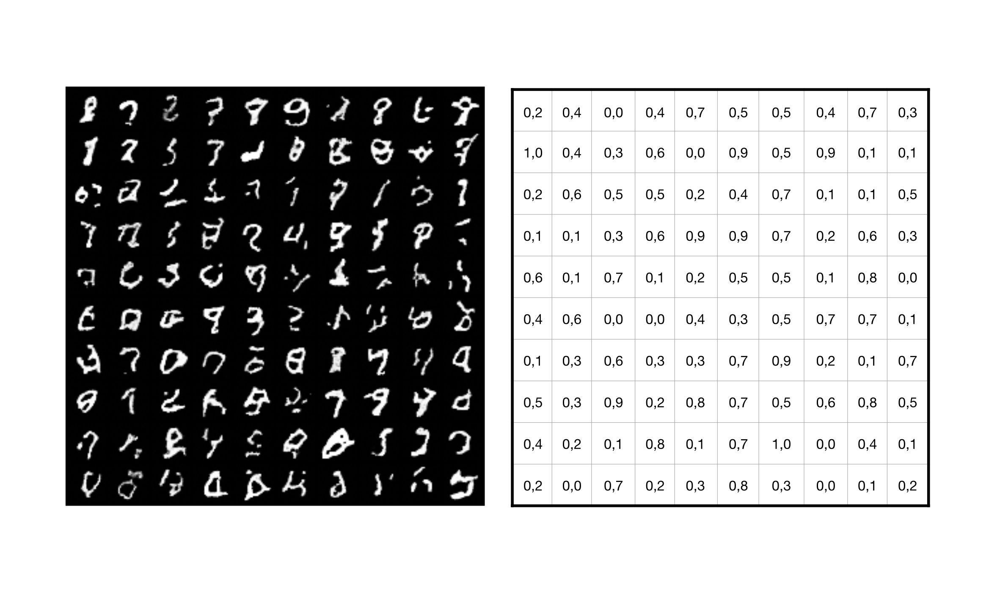

# On generative models learning complex distributions

> One  disadvantage  of  neural  networks  is  the  miss-ing  capability  to  estimate  uncertainties.  As  highly  expressivegeneral  function  estimators  neural  networks  can  approximatearbitrarily  complex  functions  but  come  at  the  drawback  thatepistemic  uncertainty  is  not  reflected.  Usually,  neural  networksare  trained  by  a  maximum  likelihood  approach  which  onlypermits  aleatoric  uncertainty  estimates  inherent  in  the  trainingdata, simply because neural networks are not designed to accountfor epistemic uncertainty. Bayesian neural networks address thisproblem by using a prior probability distribution, e.g. Gaussiandistribution,  for  the  model  parameters  that  is  updated  duringtraining.  Some  priors  converge  to  posterior  distributions  thatcan  be  approximated  well,  e.g.,  Gaussian  processes,  Brownian,frationally Brownian or non-Gaussian stable processes. However,in general, there is no guarantee that a complex posterior distri-bution can be covered precisely by a simple prior during training.Generative  models  are  one  of  the  most  promising  approachesto  analyze  and  understand  the  true  posterior  distribution  ofa  data  set.  Normalizing  flows  transform  this  simple  Gaussiandistribution  into  a  more  complex  one.  We  show  that  anew  approach  with  continuous-depth  hidden  states  called  Free-form  Continuous  Dynamics  for  Scalable  Reversible  GenerativeModels  (FFJORD)  extends  this  approach  by  making  discreteflows continuous. We show that modern generative networksare capable of learning the observation and corresponding labels.This is shown by evaluating different generative models on a dataset  with  complex  distribution.

>[continous_depth_models.pdf](https://github.com/lukasbahr/cdm/assets/cdm.pdf)

<p align="center">

</p>

## Prerequisites

Install `torchdiffeq` from https://github.com/rtqichen/torchdiffeq.

## Usage

Different scripts are provided for different datasets. To see all options, use the `-h` flag.

VAE Experiments (based on [Sylvester VAE](https://github.com/riannevdberg/sylvester-flows)) with flag 'snf' for --model.

### Homogeneous datasets

MNIST:
```
python train_cnf.py --model ffjord  --data mnist --dims 64,64,64 --strides 1,1,1,1 --num_blocks 2 --layer_type concat --multiscale True --rademacher True
```

CIFAR10:
```
python train_cnf.py --model ffjord  --data cifar10 --dims 64,64,64 --strides 1,1,1,1 --num_blocks 2 --layer_type concat --multiscale True --rademacher True
```

### Heterogeneous datasets 

MNIST:
```
python train_cnf.py --model ffjord  --data mnist --dims 64,64,64 --strides 1,1,1,1 --num_blocks 2 --layer_type concat --multiscale True --rademacher True --heterogen true
```
## Datasets

### VAE datasets
Follow instructions from https://github.com/riannevdberg/sylvester-flows and place them in `data/`.

